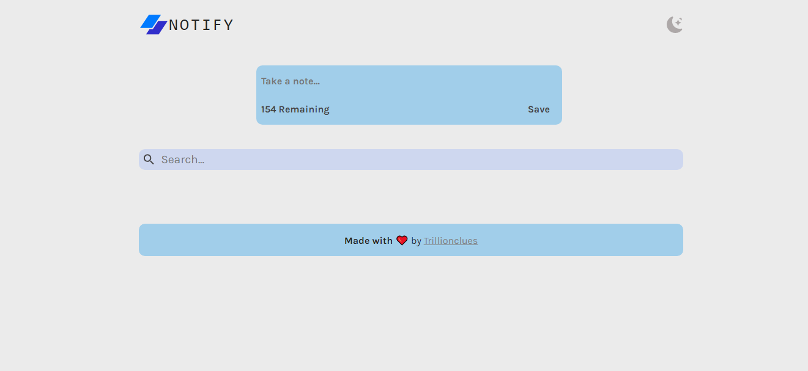

# Notify - Note taking App :page_with_curl:

## The Project
This challenge basically was to build out the UI of a regular note taking app and get it looking as close to the the famous Google Keep App as possible.

Users should be able to:

- Create and save notes which timestamps to indicate when it was taken
- Users should be able to delete notes
- Also, notes can be modified with new date stamps to indicate this
- Switch between normal and dark mode

## Tools/Technologies used

Some of the major technologies used in this projects include;

- JSX
- CSS3
- ReactJS
- MomentJS + Vite
- Styled Components

## Steps employed for project

Below is a list of processes I took to complete this challenge - in no definitive order!

1. After breaking down the app into different sections and components, I proceded to initialize the project as a public repository here on GitHub.
2. For UI inspiration, I used the Google Keep interface as a guide on the best user experience for the app.
3. Initialized React with Vite.
4. Wrote the markup(html structure) for each section before styling each component.
5. Compiled the project using `npm build`
6. Currently working on getting the 'Undo Delete' feature integrated into the app.

## Project demo

Here's a live demo of the project bellow:
[Notify App demo](https://notify-react-app.netlify.app/)

## Got feedback for me?

I am always looking to improve on my skills and appreciate receiving feedback and criticisms! So if you have anything you'd like to mention, please email trillionclues[at]gmail[dot]com.

This app is completely free to use. Please share it with anyone who will find it useful for practice.

**Have fun taking some notes so you don't forget anything!** 🚀
